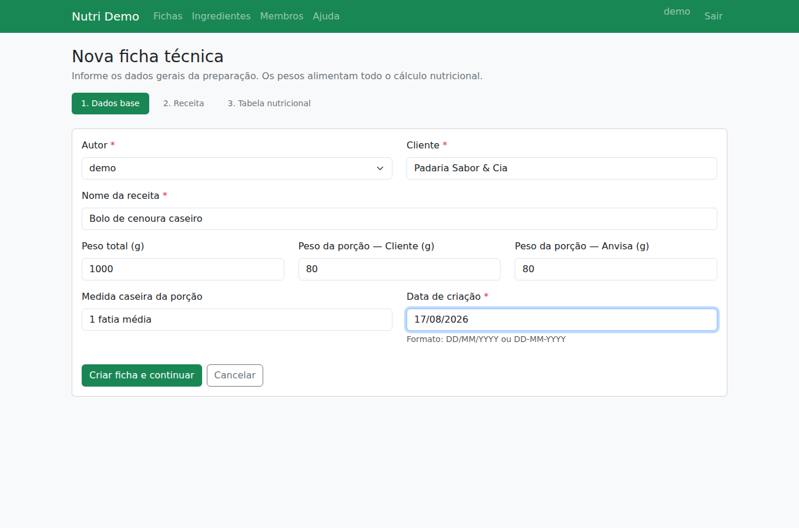
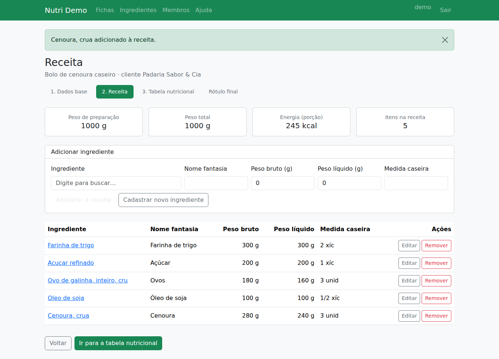
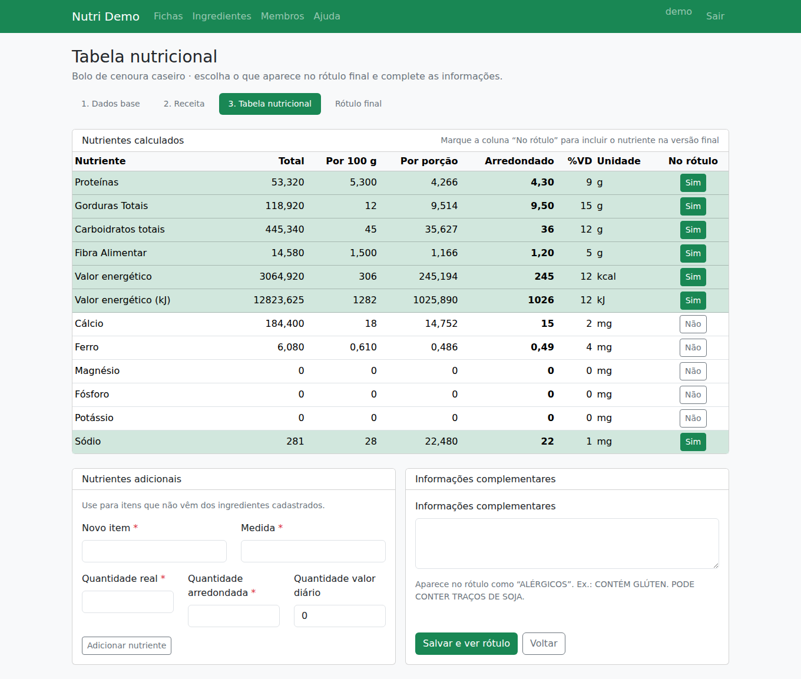
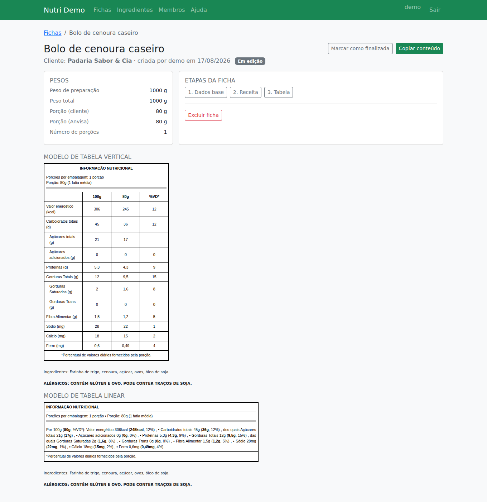
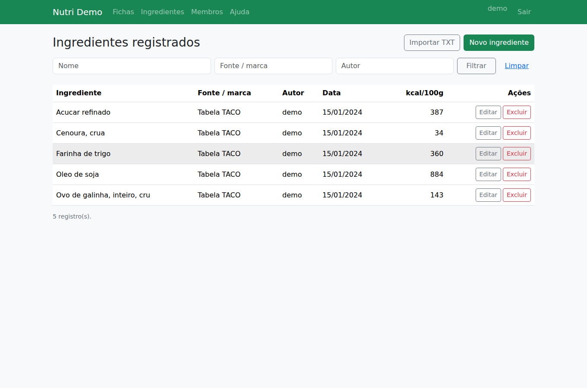
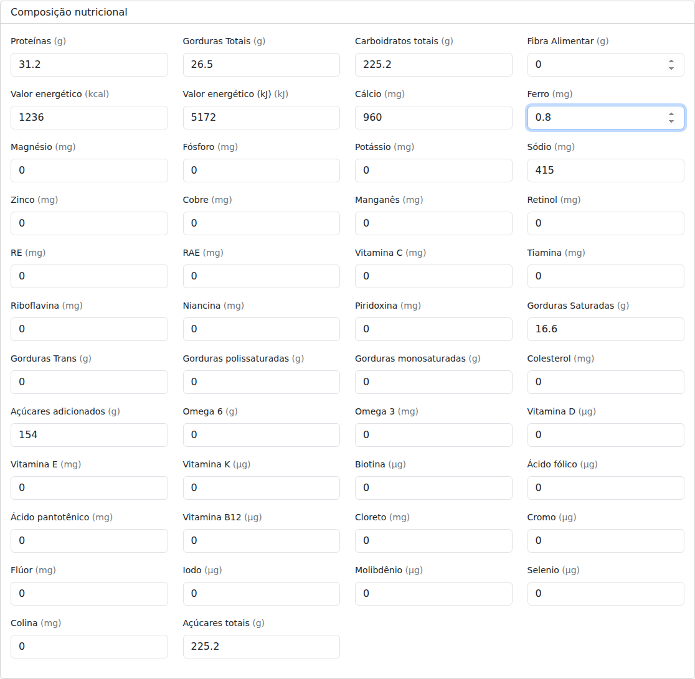
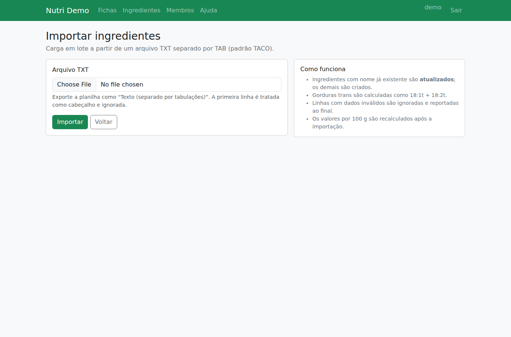

# Interface

Layout único (`templates/base.html`): barra superior com **Fichas**, **Ingredientes**,
**Membros**, **Ajuda** e **Sair**, o nome e a cor da empresa vindos da configuração da
instância, e uma área de mensagens no topo do conteúdo. Bootstrap 5 servido pela própria
aplicação. As listagens são paginadas de 25 em 25 e os filtros viajam na URL, então uma
busca pode ser compartilhada por link.

## Criar uma ficha técnica

O fluxo tem três passos, com o progresso sempre visível.

### 1. Dados base — `/registrarFicha1`
Autor, cliente, nome da receita, peso total, peso da porção (cliente e ANVISA), medida
caseira e data. Os pesos alimentam todo o cálculo; sem peso total e peso da porção não é
possível montar a receita.

### 2. Receita — `/registrarFicha2/<pk>`
Cada item é um ingrediente do cadastro (campo com autocompletar, por nome exato), com nome
fantasia, pesos bruto e líquido e medida caseira. A cada item adicionado, os totais no topo
são recalculados.

### 3. Tabela nutricional — `/registrarFicha3/<pk>`
Todos os nutrientes com valor total, por 100 g, por porção, arredondado e %VD. A coluna
"No rótulo" liga e desliga cada linha da versão final. Ao lado, o campo de informações
complementares (alérgicos) e o cadastro de nutrientes extras manuais.

### Rótulo final — `/fichaX/<pk>`
Pesos da preparação, os modelos **vertical** e **linear** da tabela, lista de ingredientes,
alérgicos e as lupas "ALTO EM" quando aplicável. O botão **Copiar conteúdo** leva o bloco
pronto para o Google Docs; **Marcar como finalizada** aplica o selo.

Quando os valores gravados não conferem com o cálculo atual dos pesos da ficha, a tela
mostra um aviso com as diferenças e um botão de recálculo explícito (D-017).

## Ingredientes

### Listagem — `/listaIngredientes`
Filtros por nome, fonte/marca e autor, com a energia por 100 g de cada registro e ações de
editar e excluir.

### Cadastro — `/registrarIngrediente`
Identificação (nome, autor, composição, fonte, **quantidade de referência**, data) e a
composição nutricional. Os valores são informados para a quantidade de referência: uma lata
de 395 g pode ser cadastrada como tal, e o sistema normaliza para 100 g.

### Importação em lote — `/upload`
TXT separado por TAB no layout da TACO, para carregar a base inicial de ingredientes de uma
vez (BR-023).

## Fichas, membros e ajuda

- **`/listaFichas`** — listagem inicial, com filtros por receita, cliente e autor e o selo
  das fichas finalizadas.
- **`/listaMembros`** — quem tem acesso à instância. Para administradores, mostra a chave
  de cadastro e permite trocá-la, redefinir a senha de um membro e excluir membros
  transferindo a autoria das fichas e ingredientes.
- **`/registrarMembro`** — auto-cadastro com a chave da instância.
- **`/ajuda`** — instruções de uso para a equipe.
- **`/admin/`** — Django admin, restrito a superusuários; é onde se edita a
  **Configuração da instância** (nome, logotipo, cor, ano de corte).

As capturas completas de cada fluxo estão em `docs/imagens/criacao-receita/` e
`docs/imagens/cadastro-ingrediente/`, com legenda no `LEIA-ME.md` de cada pasta.
